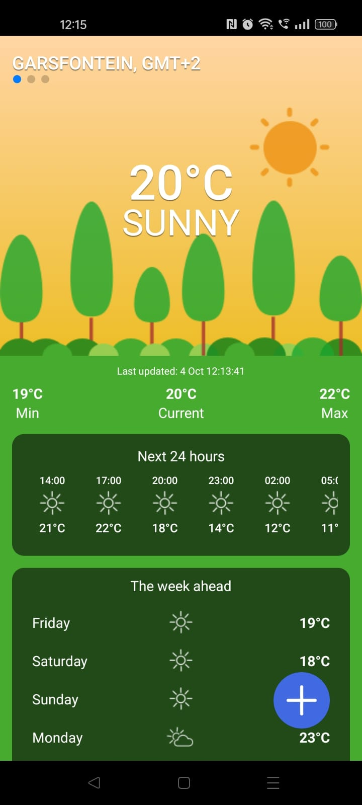
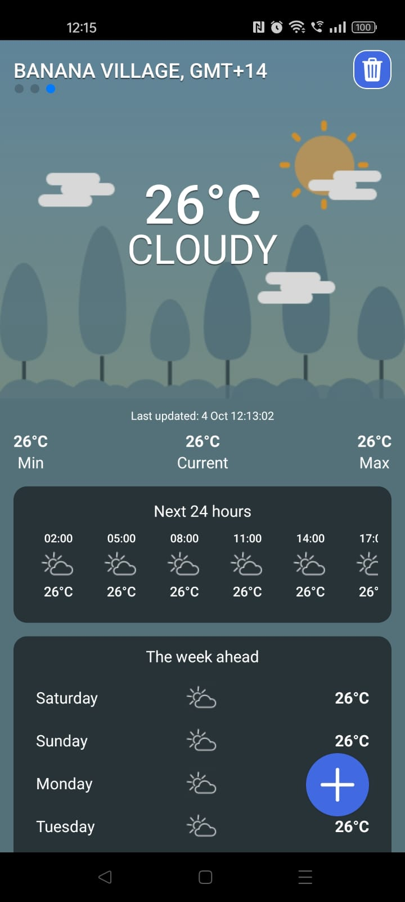
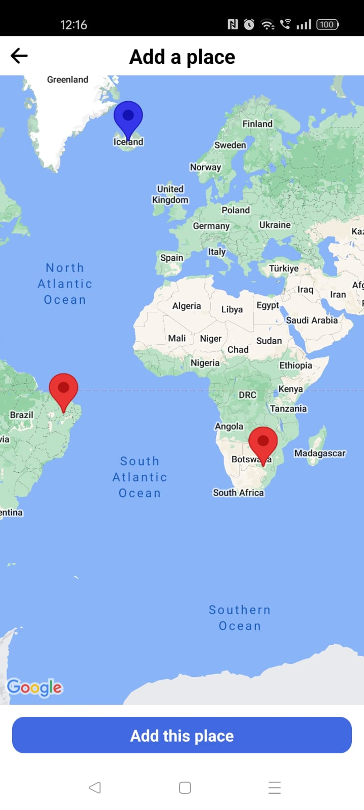
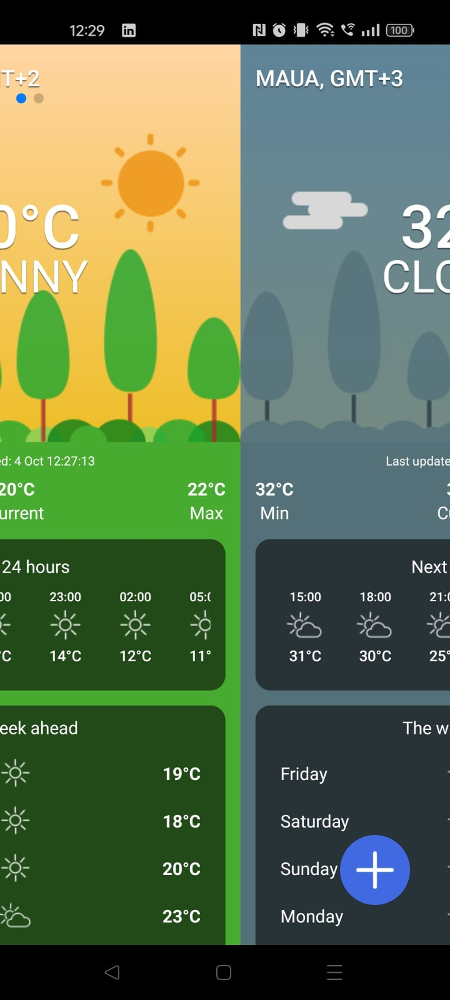

# weather-app

## Project overview

This is a simple Android app to display the weather as retrieved from [OpenWeatherMap](https://openweathermap.org/).

This project is built with [Expo](https://expo.dev) (which itself is built on [React Native](https://reactnative.dev)).

The workspace was initiated with `npx create-expo-app@latest --template blank-typescript`.

**Note:** the project can easily be adapted to run on iOS as well, but I do not have any Apple devices for testing or development purposes.

## Dependencies

- `axios` - for making requests to APIs
- `date-fns` - utility library for date functions
- `expo` - allows use of Expo modules within React Native
- `expo-location` - provides access to device location API
- `expo-status-bar` - controls of StatusBar in an Expo environment
- `react` - the React library for building user interfaces
- `react-native` - React for mobile apps
- `react-native-maps` - allows embedding of Google Maps
- `react-native-swiper` - for swiping between screens
- `react-native-uuid` - generate UUIDs for use as keys in dynamic arrays
- `@react-native-async-storage/async-storage` - API for saving and loading JSON data as strings
- `expo-dev-client` - Expo tools

## Development dependencies

- `@babel/core` - Babel compiler core
- `@types/date-fns` - TypeScript types for `date-fns`
- `@types/react` - TypeScript types for `react`
- `typescript` - For transpiling TypeScript to JavaScript

## Getting started

**An Android device or emulator is required for running the application.**

This guide assumes a working development environment with Android Studio, Java, `npx`, etc. already installed and configured. Setting up the dev environment is beyond the scope of this document, however you may refer to [Set up your environment](https://docs.expo.dev/get-started/set-up-your-environment/) in the Expo documentation.

Install all the project dependencies, e.g.

```
$ npm install
```

Make sure an emulator is running (or a device is connected with USB debugging enabled).

Verify that your emulator/device is visible to the system, e.g.

```
$ adb devices
List of devices attached
emulator-5554   device
```

Start the development server, e.g.

```
$ npm run android

> weather-app@1.0.0 android
> expo start --android

Starting project at /home/dylan/Projects/weather-app
Starting Metro Bundler
› Opening exp+weather-app://expo-development-client/?url=http%3A%2F%2F10.0.0.10%3A8081 on Medium_Phone_API_35
```

Follow the prompts to install [Expo Go](https://expo.dev/go) on the emulator/device.

## The development process

### The weather API provides many weather conditions for which no assets were provided

I was only provided with 3 background images (and their matching icons), specifically for "cloudy", "rainy" and "sunny" conditions.

Consequently I am mapping these extra weather conditions (e.g. snow, mist, thunderstorm) to one of the aforementioned supplied conditions.

There are also no images/icons for differentiating between day and night conditions. The supplied "sunny" condition should rather have been called "clear skies" and provided variants for day and night.

I tried to generate my own images with an AI tool but the results were unusable to me.

### I implemented all the base required features

1. The Forest design, with some tweaks and additions
2. Indicating the current and forecast weather at the user's location
3. Changing the background image and using icons to portray weather conditions

### Extra features that I implemented

1. Showing the name (or coordinates, if no name is returned) of a place, as well as its timezone (e.g. GMT+2).
2. A "Next 24 hours" forecast display that shows the time, temperature, and weather icon at 3-hour intervals. Note that this is shown in the local time at the coordinate, and not in the returned UTC time.
3. Adding of additional places (user-added locations).
4. Indicating the coordinates of a place on a map, (as well as showing all places that have been added on a map in the "Add a place" screen).
5. Saving/loaded the weather for all places.
6. "Last updated" functionality with a pull-to-refresh gesture to update the weather.

### Features that I thought about but did not pursue

1. Automatically refreshing the weather based on the difference between current time and the "last updated" time.
2. Showing nearby photos for places using the Places API (this does not really make sense in the context of a weather app, but it's something that could easily be done).
3. Custom splashscreen and app icons (I am just using the Expo default ones).
4. Allowing to choose the theme, e.g. "forest" or "sea".

### Look and feel of the app

I was inspired by the weather app which was preinstalled on my phone. I am not a UI/UX specialist and having an example of a working app to draw ideas from was very valuable. My preference would of course be to work with a designer and simply implement their Figma (etc) designs, rather than come up with my own.

My intention was to avoid "Settings" screens or anything of that nature, and have all the functionality for adding/deleting/switching places be accessible without cluttering the app with many settings screens and modals.

1. New places are added by using the large floating action button (FAB) with + icon.

2. Adding a place is done via a map interface which can simply be tapped to specify coordinates.

3. Places are deleted by using the trash icon in the top right corner. Note that the home screen (indicating the user's location) cannot be deleted.

4. Swiping left and right will take you to the weather screen for the previous/next place. The number of places (and current active place) is indicated by dots in the top left corner. Note that dots are not visible until at least one new place has been added.

5. The 24-hour forecast can be scrolled horizontally, in the event that it does not fit on the device display.

6. The weather is refreshed by dragging down from the top of the screen. A refresh indicator will appear. Note that refreshing the weather at the user's location will also update the location.

### Architecture of the app

Due to the simplicity of the project, there is not much to talk about here.

The main entry point of the app (`App.tsx`) holds almost all of the state. It is responsible for fetching of the weather data and for feeding it to its children, which are the weather screens for each place. It also handles the persisting of weather data to local storage.

The weather screens do not have state aside from whether they are currently being refreshed. They merely receive props and callbacks from their parent and derive local variables from it.

## Screenshots

\
The weather at my house.

\
The weather at Banana Village (GMT+14). Note the 24-hour forecast uses the local time at the location.

\
Adding a place on the map. Red markers are previously added locations, blue is the pending (new) location.

\
Halfway between swiping from one place screen to the next.
